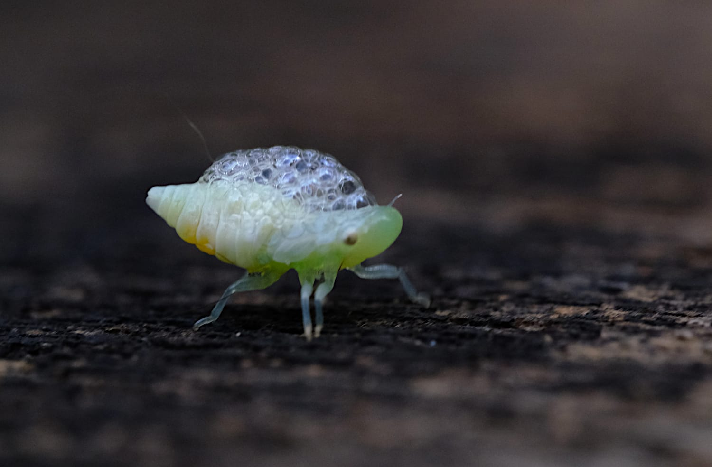

photo by: Mr Tang 

- nymph taps into the sap of the plant, eats and exudes it, frothing and bubbling it around itself
- foam stops it from dehydrating and hides the nymph from predators such as ants 
- once it has grown to full size, its back splits open and it emerges from this casing in adult form with wings and wing cases that protect it from predators.

https://www.nhm.ac.uk/discover/cuckoo-spit-and-fascinating-froghoppers-spittlebugs.html 