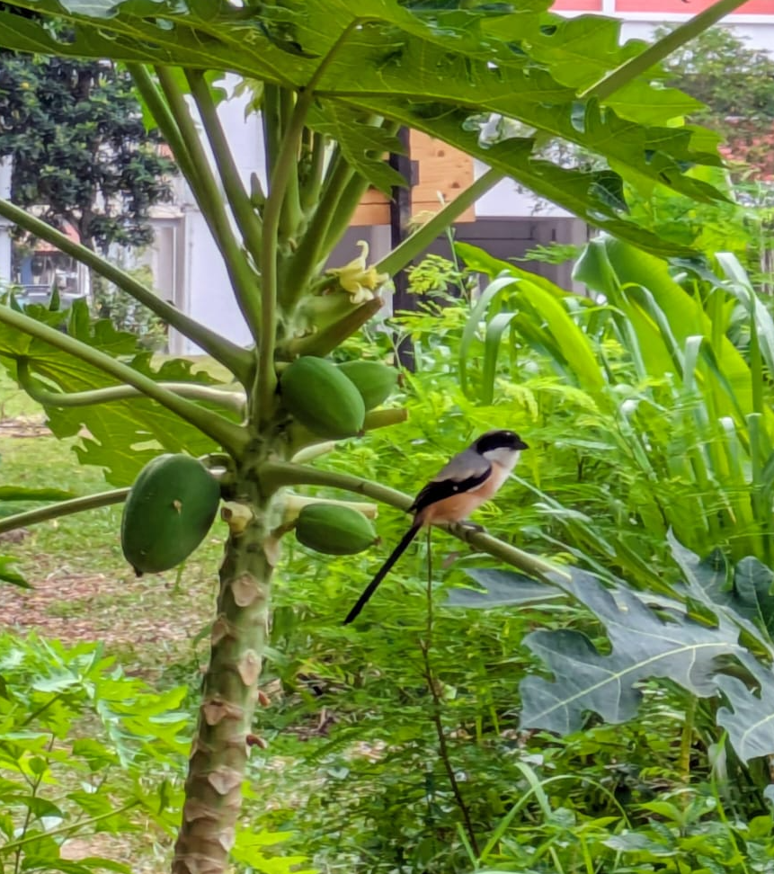

- one of Singapore's three species of shrikes, and the only resident species 
- badass: bandit look due to the black eyeband
- their diet includes dragonflies, butterflies, moths, grasshoppers and plenty of centipedes 

sources: 
- https://singaporebirds.blogspot.com/2012/06/shrikes.html
- https://singaporebirdgroup.wordpress.com/2015/10/17/long-tailed-shrike-fledglings-and-their-diet/ 