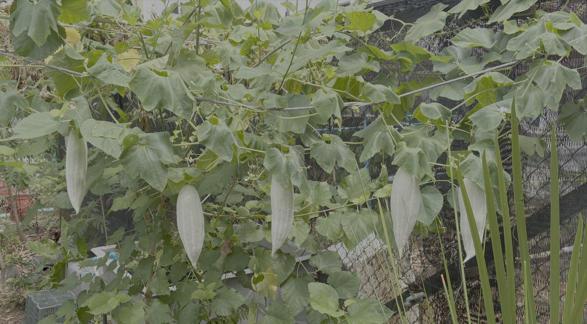

- eaten as an immature fruit (with white and green streaks), normally 2-3 months after sowing
- mature fruit is bright orange and red with bright red seeds
- they are night-blooming, their curly tendrils open up at night to form an intricate lace around the flower

(add pic of flowers) 

sources: 
- https://gardeningsg.nparks.gov.sg/gardening-resource-library/snake-gourd/
- https://agriculture.institute/production-tech-vegetables-crops/harvesting-techniques-bitter-sponge-snake-gourd/#when-to-pick 
- https://youdimsumyoulosesome.com/snakes-and-flowers/ 